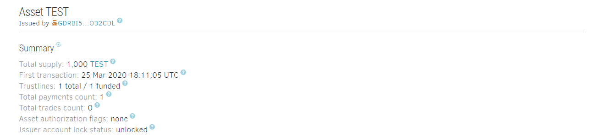
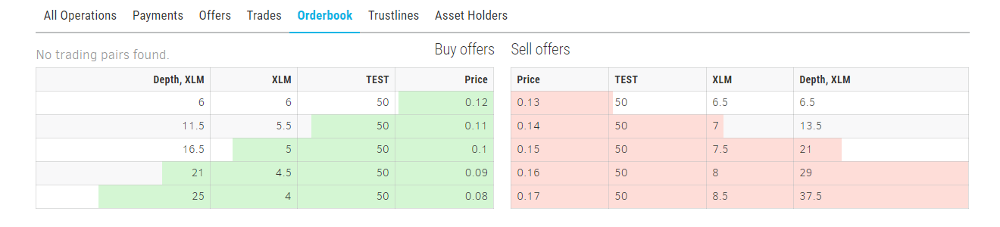

# Stellar Asset Issuer Script

Python script that issues an asset on the Stellar testnet and creates a distributor account and a simple market. 

**Note:** Don't consider this script a 'perfect' implementation of anchors or markets. This script will only work on testnet. In order to create a mainnet version you will need lumens and you will need to fund accounts yourself. The ```generate_keypair()``` function would also need to be supplemented with a Create Account operation. This implementation is for educational purposes and there is no error checking. 

## Why is this useful? 

One of the issues we've seen new Stellar developers run in to is creating new assets and markets. The reason it's tricky is due to the overhead that comes with some of the steps. What is an anchor? What is an issuing account and how is that different than a distrubtor account? What is a trustline? How the heck do I make a market? 

This script aims to make all of that more clear through the code, comments, and this README. 

Really quick, here's some terms to know: 

**```Trustline```** - Establishment of trust between two accounts for an asset. Account A *trusts* an Issuing Account to issue an asset. After *trusting* an account for an asset (e.g. KUSD), the account can receive that asset. 

**```Issuing Account```** - Account responsible for issuing the asset it is trusted for. Let's say Bank of Kolten wants to issue KoltenUSD (KUSD). All users who want to hold KoltenUSD have to trust **my issuing account** for KUSD in order to receive it and verify that they are getting the real KUSD. 

**```Distributor Account```** - Account responsible for distributing an asset. This is the second account owned by Bank of Kolten and is responsible for sending KUSD to users. This seperates the logic between issuing an asset and distributing an asset, along with providing transparency in to the ```Supply```. ```Distributor Accounts``` are not necessary but are generally recommended. 

**```Supply```** - An ```Asset's``` total ```Supply``` is the amount of that ```Asset``` **in circulation** on Stellar. ```Issuing Accounts``` don't maintain a balance or ```Supply```, so this metric is not tracked until an ```Asset``` is sent from the ```Issuing Account``` to another. That's why it's important to have a ```Distributor Account```!

**```Asset```** - An ```Asset``` is Stellar's respresentation of some form of value issued by a specific entity. An ```Asset``` is 'created' when one account establishes a ```Trustline``` with another *for* that ```Asset```. 

**```Stellar DEX```** - The Stellar Decentralized Exchange is an open orderbook maintained on the Stellar ledger. Anyone can view and submit offers to the Stellar DEX and liquidity is shared across the network. 

**```Buy Offers```** - A ```Buy Offer``` is an offer to buy an asset for a set price. In this script, the buy offers are specifying that they would like to buy ```Asset``` for some amount of XLM.  

**```Sell Offers```** - A ```Sell Offer``` is an offer to sell an asset for a set price. In this script, the sell offers are specifying that they would like to sell ```Asset``` for some amount of XLM. 

## What does it do? 

The steps this script goes through are as follows: 
- Create ```Issuing Account``` + fund with testnet lumens 
- Create ```Distributor Account``` + fund with testnet lumens
- Create trustline from ```Distributor Account``` to Issuing Account for ```Asset X```
- Send ```Supply``` from ```Issuing Account``` to ```Distributor Account```
- Create ```Buy Offers``` for ```Asset X``` using 1/4 of the ```Supply``` in ```Distributor Account```
- Create ```Sell Offers``` for ```Asset X``` using 1/4 of the ```Supply``` in ```Distributor Account```

Here's an example of an asset called ```TEST``` with a supply of ```1,000``` and an active market. 

<div align="center"></div>
<br>
<div align="center"></div>
<br>

## Nice, how do I use it? 

Using the script is pretty simple by design but there are a couple of requirements. 
- You must have Python installed. 
- Python Requests must be installed: ```pip install requests```
- The Stellar Python SDK (newest version) must be installed: ```pip install stellar-sdk```

To run the script compile it as you normally would, but include 3 command line arguments: <br>
```python argparse.py TOKENCODE SUPPLY y```
- ```TOKENCODE``` is an identifier for your asset (e.g. USD) - 12 character maximum.  
- ```SUPPLY``` is the total supply of your asset (e.g. 100). 
- ```y``` specifies that you want to create a market for the asset. Any other input prevents the market from being made. 

Example: <br> 
```python argparse.py TEST 1000 y```

You will get feedback from the console giving you the ```Issuer Keypair``` and ```Distributor Keypair``` and what step the script is on. 
